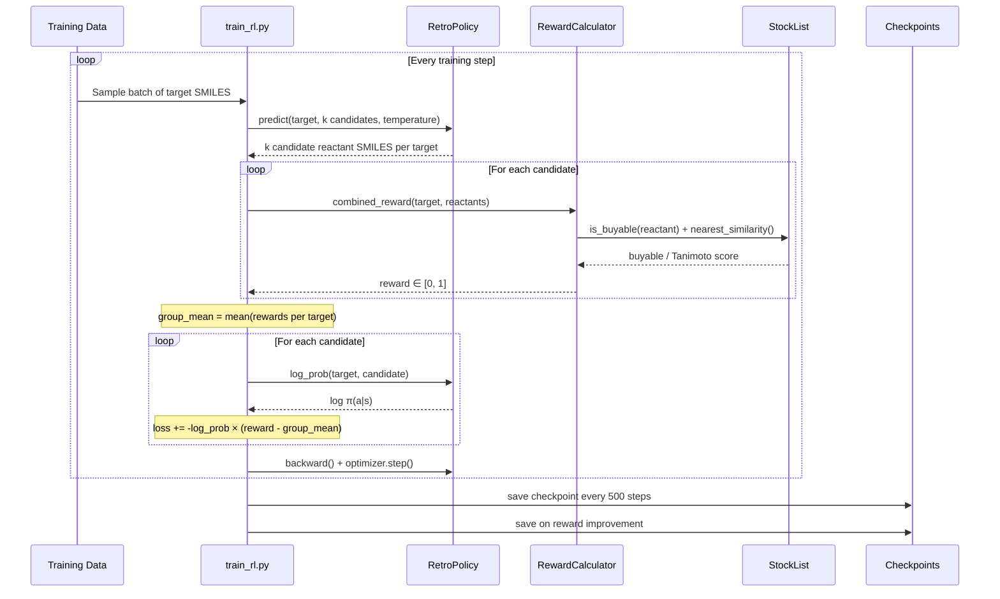
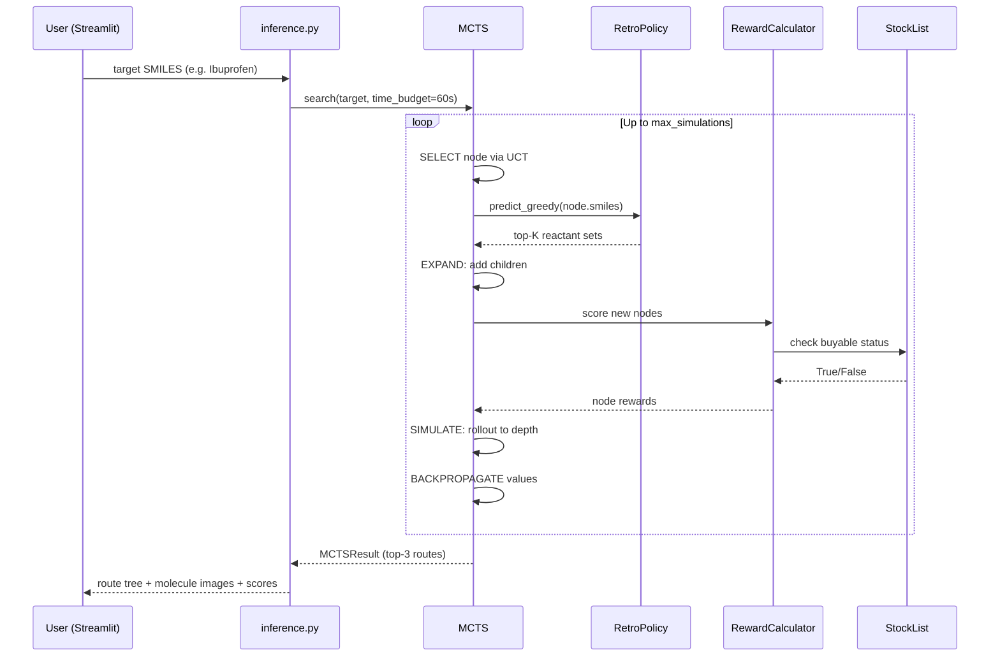
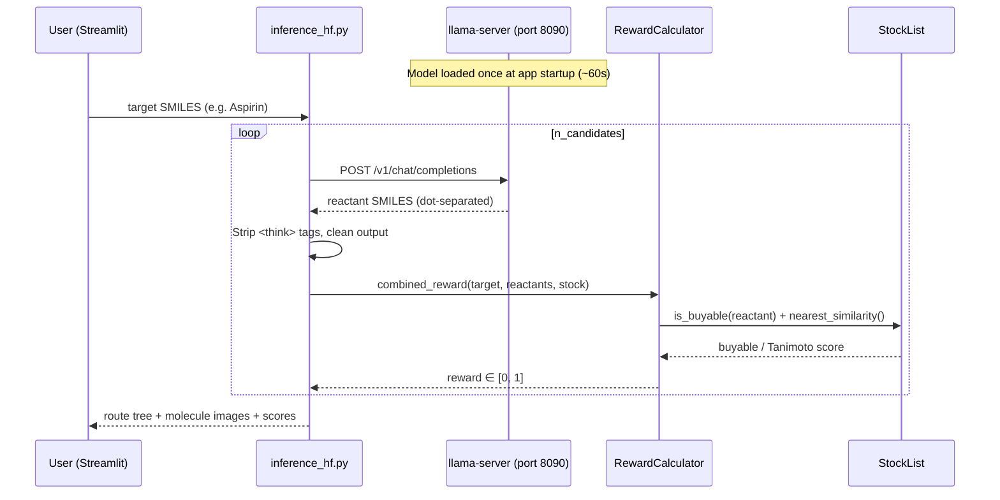
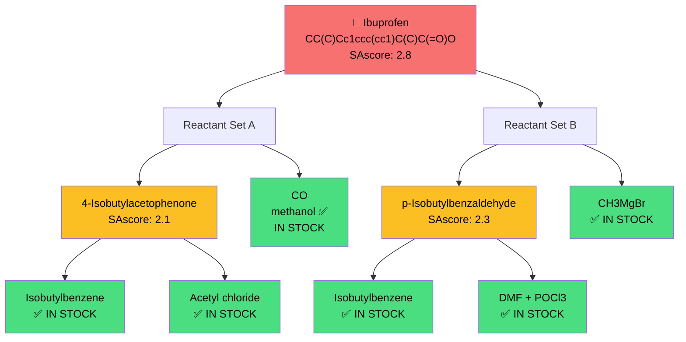
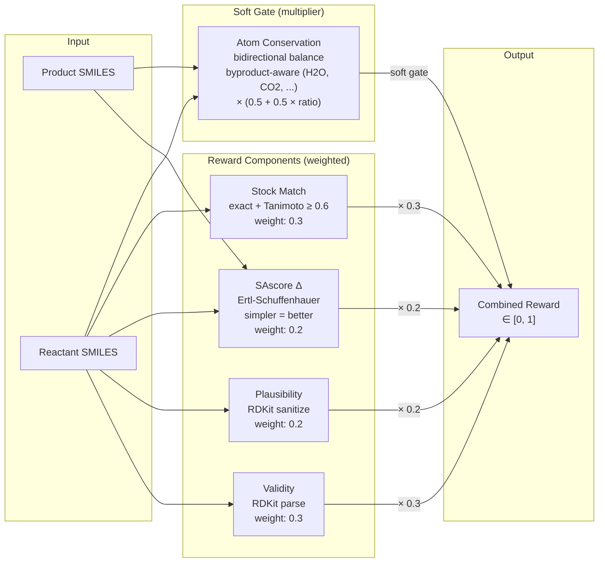
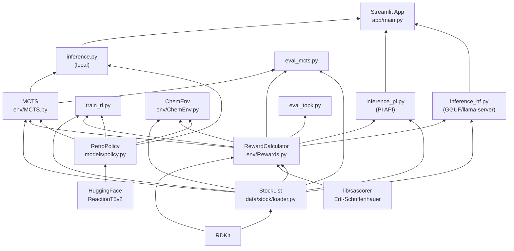
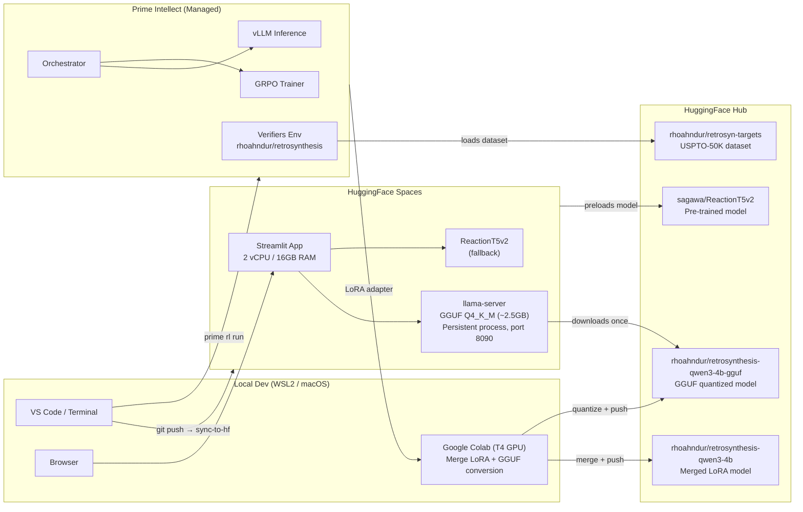
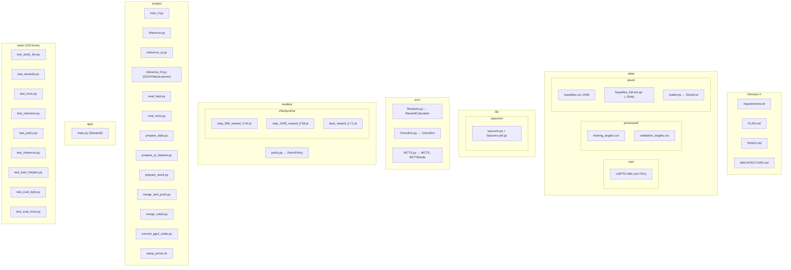

# Architecture — Retrosynthesis RL MVP

## System Overview

```mermaid
graph TB
    subgraph User["User Interface"]
        ST["Streamlit App<br/>app/main.py"]
        P3D["py3Dmol 3D Viewer"]
        RDK_DRAW["RDKit 2D Mol Images"]
    end

    subgraph Inference["Inference Layer"]
        INF_HF["inference_hf.py<br/>GGUF: llama-server + CPU"]
        INF["inference.py<br/>Local: ReactionT5 + MCTS"]
        INF_PI["inference_pi.py<br/>PI: OpenAI API + reward scoring"]
        MCTS["MCTS Engine<br/>env/MCTS.py"]
    end

    subgraph RL["RL Training Layer"]
        TRAIN["train_rl.py<br/>REINFORCE + GRPO advantage"]
        CKPT["Checkpoint Manager<br/>Save/load/prune .pt files"]
    end

    subgraph Eval["Evaluation Layer"]
        EVAL_TK["eval_topk.py<br/>Top-K exact match + SA buckets"]
        EVAL_MC["eval_mcts.py<br/>Full-route success rate"]
    end

    subgraph Core["Core Modules"]
        POLICY["RetroPolicy<br/>models/policy.py"]
        REWARD["RewardCalculator<br/>env/Rewards.py"]
        ENV["ChemEnv<br/>env/ChemEnv.py"]
        STOCK["StockList<br/>data/stock/loader.py"]
    end

    subgraph Model["Pre-trained Model"]
        RT5["ReactionT5v2<br/>sagawa/ReactionT5v2-retrosynthesis<br/>HuggingFace"]
    end

    subgraph Chem["Chemistry Engine"]
        RDKIT["RDKit<br/>Validity · Sanitization<br/>Mol rendering · Canonicalization<br/>Morgan FP · Tanimoto similarity"]
        SASCORE["SA Scorer<br/>lib/sascorer (vendored)<br/>Ertl-Schuffenhauer algorithm"]
    end

    subgraph Data["Data Layer"]
        CSV["buyables.csv<br/>246 common reagents"]
        SMIGZ["buyables_full.smi.gz<br/>~204k ASKCOS compounds"]
        TDC["TDC / USPTO-50K<br/>Training targets"]
        TARGETS["training_targets.csv<br/>Diverse product SMILES"]
        CKPT_DIR["models/checkpoints/<br/>step_N_reward_R.pt"]
    end

    subgraph Infra["Infrastructure"]
        MAC["MacBook Air M3<br/>Local dev + testing"]
        PI["Prime Intellect<br/>GRPO RL Training (managed)"]
        HFS["HuggingFace Spaces<br/>Streamlit deployment"]
    end

    subgraph GGUF["GGUF Model (HF Hub)"]
        GGUF_MODEL["rhoahndur/retrosynthesis-qwen3-4b-gguf<br/>Q4_K_M ~2.5GB"]
        LLAMA["llama-server<br/>Persistent HTTP process<br/>port 8090"]
    end

    %% User → Inference
    ST -->|"SMILES input"| INF_HF
    ST -->|"SMILES input"| INF
    INF_HF -->|"route tree + images"| ST
    INF -->|"route tree + images"| ST
    ST --- P3D
    ST --- RDK_DRAW

    %% GGUF inference internals
    INF_HF -->|"HTTP POST"| LLAMA
    LLAMA -->|"loads model"| GGUF_MODEL
    INF_HF -->|"score results"| REWARD
    INF_HF -->|"check stock"| STOCK

    %% Local inference internals
    INF --> MCTS
    MCTS -->|"expand nodes"| POLICY
    MCTS -->|"score nodes"| REWARD
    MCTS -->|"check terminal"| STOCK

    %% Training internals
    TRAIN -->|"generate reactants"| POLICY
    TRAIN -->|"compute reward"| REWARD
    TRAIN -->|"check stock"| STOCK
    TRAIN -->|"save/load"| CKPT
    TRAIN -->|"sample targets"| TARGETS

    %% Eval internals
    EVAL_TK -->|"score predictions"| REWARD
    EVAL_MC -->|"search routes"| MCTS
    EVAL_MC -->|"check stock"| STOCK

    %% ChemEnv wiring
    ENV --> POLICY
    ENV --> REWARD
    ENV --> STOCK

    %% Core → Foundation
    POLICY -->|"wraps"| RT5
    REWARD -->|"validity"| RDKIT
    REWARD -->|"SAscore"| SASCORE
    STOCK -->|"canonicalize + fingerprints"| RDKIT
    RDK_DRAW -->|"MolToImage"| RDKIT
    STOCK -->|"loads"| CSV
    STOCK -->|"loads"| SMIGZ

    %% Checkpoints
    CKPT -->|"write"| CKPT_DIR
    INF -->|"read"| CKPT_DIR

    %% Data
    TDC -->|"prepare_data.py"| TARGETS

    %% Infra
    MAC -.->|"dev + test"| ST
    PI -.->|"train + serve"| TRAIN
    PI -.->|"SSH tunnel"| ST
```

## Data Flow: Training

## Data Flow: Inference (Demo)

## Data Flow: Inference (RL Model / GGUF)

## MCTS Tree Structure

## Reward Function Breakdown

## Module Dependency Graph

## Infrastructure Topology

## File Map

